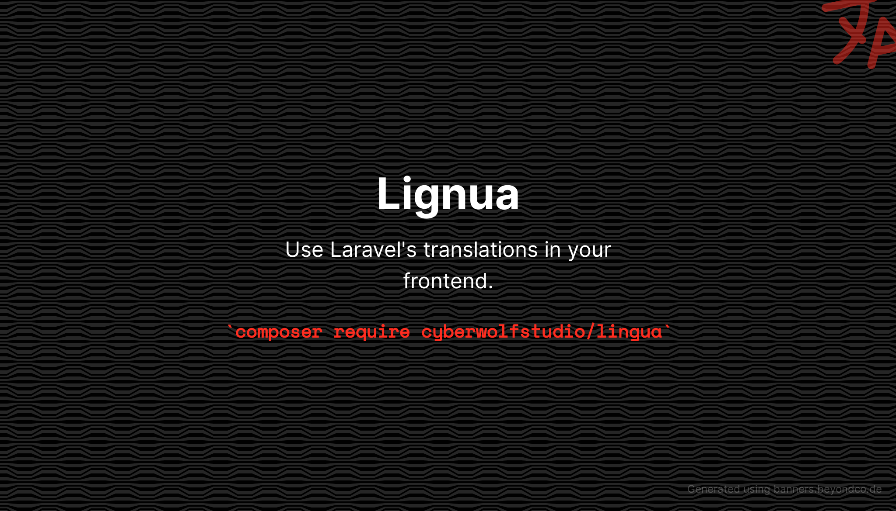

[](https://stand-with-ukraine.pp.ua)
[](https://stand-with-ukraine.pp.ua)
[](https://stand-with-ukraine.pp.ua)
[](https://stand-with-ukraine.pp.ua)



##### Originally based on [Zora](https://github.com/jetstreamlabs/zora), but was hard modified.

# Generate translations into JS file

This library allows you to generate your Laravel translations to your asset pipeline for use in JavaScript packages like
Vue. (React coming soon)

# Requirements

* **Laravel**: ^9.* or higher
* **InertiaJS**: ^1.*
* **VueJS**: ^3.*
* **ViteJS**: ^3.*

## Installation

First, install the package via composer:

``` bash
composer require cyberwolfstudio/lingua
```

The package will automatically register itself.

Next add an alias to your `vite.config.js`

```js
 resolve: {
    alias: {
        ...
        'lingua-js': resolve(__dirname, 'vendor/cyberwolfstudio/lingua/dist/index.js')
    },
},
```

To build your Laravel translation into JS file, use:
```bash
php artisan lingua:generate
```

You can automate that process as you wish.
But we recommend you a vite plugin called [vite-plugin-run](https://github.com/innocenzi/vite-plugin-run)
Install it using you package manager and just add this lines to your `vite.config.js` plugins section.
```js
 run({
    name: "generate translations",
    run: ['php', 'artisan', 'lingua:generate'],
    pattern: ['resources/lang/**', 'lang/**'],
})
```

Example of usage: (running only at serve process)
```
{
            ...run([
                {
                    name: 'generate translations',
                    run: ['php', 'artisan', 'lingua:generate'],
                    pattern: ['resources/lang/**', 'lang/**'],
                },
                {
                    name: 'generate ziggy',
                    run: ['php', 'artisan', 'ziggy:generate'],
                    pattern: ['routes/**'],
                }
            ]),
            apply: 'serve'
        }
```


### VueJS

In your `resources/js/app.js` and (if you use SSR) `resources/js/ssr.js` add imports

```js
import { LinguaVue } from 'lingua-js'
import { Lingua } from './lingua'
```
and register LinguaVue plugin

```js
...
.use(LinguaVue, {
    Lingua
})
```

Add `locale` key into your `HandleInertiaRequest::share` method

```php
[
    ...
    locale' => fn() => app()->getLocale(),
    ...
]
```
That's how your application will know your initial locale.

### React

Coming soon


## Usage

In your template tag use it in Laravel style, like

```js
__(key: string, replacers: array)

//or

trans(key: string, replacers: array)
```

You can also use trans in your `setup` function by injecting it.

```js
const trans = inject('trans') 
```

# Changelog

All changes made here will be described in [Changelog.md](./CHANGELOG.md) file.
